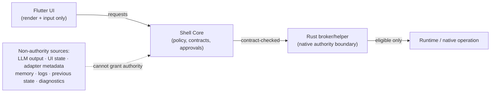
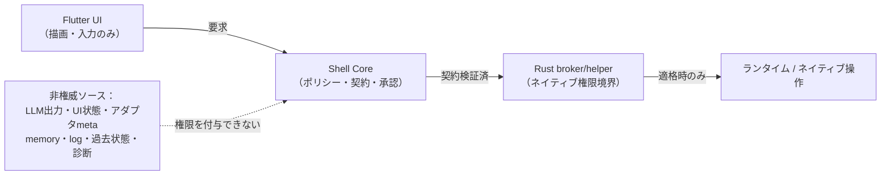

<div align="center">

# 🦝 GUI-Shell

**A Windows-first desktop Runtime Operation Shell that keeps authority behind explicit contracts — not hidden UI state.**

[](LICENSE)
[-orange)](release_blockers.registry.json)
[](#windows-first-scope)
[](#architecture)
[](specs)
[](tooling/conformance_tests)
[](#what-is--and-is-not--claimed)

**English** · [日本語](#-gui-shell-日本語版)

</div>

---

> **TL;DR** — GUI-Shell is a desktop control plane that sits between an operator and one or more local runtimes/agents. Its whole point is a boundary: the UI renders and collects input, but it never *owns* authority. Permissions, approvals, audit, and recovery live behind typed contracts and machine-checked gates. This repository is the public, reviewable slice of that design. It is also built to be **read and extended by other LLMs** — and the fact that an LLM built this repo end to end is a bounded demonstration of that goal.

## Who built this — and why that's the point

This project was built by **a non-programmer / non-software developer**: no programming experience, no software-development background, not an IT professional, and no working knowledge of English. The code, the contracts, and even this README were produced **by directing an LLM** — in less than one month of **part-time** work, not a full-time effort.

That is not a claim that anyone can do this, and it is not a claim that the result is finished. It's a claim about *where the difficulty actually lives*. The hard part of a system like this was never typing the code. The hard part is **refusing to trust unverified output** — yours, the LLM's, the UI's, an adapter's. So the bet of this project is structural, not manual:

- every capability claim is **bound to a machine-checked gate**, and
- everything **not yet proven is listed as a release blocker** — not quietly omitted.

If that discipline holds, it shouldn't matter much who typed it. That's the thing being demonstrated.

**And building it through an LLM was not incidental — it is the thesis.** GUI-Shell's goal is to be an *LLM-readable responsibility substrate*: a codebase a **different** LLM can read and safely extend. The most direct way to demonstrate that property is to construct the system through an LLM in the first place — from its own contracts, schemas, and conformance rules. If an LLM can build this from the contracts, an LLM can read those contracts and extend it. The construction is a bounded demonstration of the design goal. The schemas in `specs`, the checks in `tooling/conformance_tests`, and the standards in `docs/standards` are written to be consumed by agents, not only by people. What that demonstrates is deliberately bounded — an agent can extend the system *within declared contracts*; it is not a claim of broad interoperability or public-standard adoption (see *What is — and is NOT — claimed* below).

## What GUI-Shell is

GUI-Shell is a generic **Runtime Operation Shell** control plane. It sits between an operator and one or more runtimes, exposing status, approvals, diagnostics, and recovery surfaces **without making the UI itself the authority boundary**.

The current public package focuses on the desktop implementation and the validation substrate:

- Flutter desktop UI in `apps/desktop_flutter`
- Rust broker/helper in `native/rust_helper`
- Shell Core and adapter packages in `packages`
- JSON Schema contracts in `specs`
- validation, manifest, release-gate, and evidence tooling in `tooling`
- Windows installer/evidence collectors in `installer/windows`

It is also documented as an **LLM-readable responsibility substrate**: schemas, conformance checks, release gates, approval boundaries, and recovery paths are meant to be read and extended by implementation agents — while the LLM stays non-authoritative and the human operator keeps final approval, recovery, and release authority.

## Why it exists

Agent and local-runtime tools routinely blur four different things: UI state, runtime state, diagnostics, and execution authority. GUI-Shell forces them apart:

- the **UI** renders and collects operator input — nothing more;
- **Shell Core** owns policy-shaped state and contract checks;
- **adapters** normalize runtime data but cannot grant authority;
- the **Rust broker** is the intended native boundary for authority-sensitive paths;
- **release evidence** is kept separate from release *claims*.

## Architecture



Sensitive actions must map to **capability → permission → approval state → audit event → recovery action**. Nothing in the dotted box above can substitute for that mapping.

Key directories:

| Path | Role |
|---|---|
| `apps/desktop_flutter` | desktop operator UI |
| `packages/shell_core` | runtime-neutral policy, approval, audit, recovery, state |
| `packages/blue_tanuki_adapter` | reference adapter boundary example |
| `native/rust_helper` | broker IPC, audit anchor, diagnostics |
| `specs` | JSON Schema contracts |
| `tooling/conformance_tests` | authority & evidence conformance checks |
| `installer/windows` | Windows staging and evidence collectors |

> **Honest note on the boundary.** The Rust broker is the *target* native authority boundary. Today, authority-sensitive logic still runs in the **Python reference implementation** under `packages/shell_core`. Completing the migration to the Rust broker — with broker-mediated Flutter paths and no-Python-runtime product evidence — is an open **release blocker**, not a solved problem (see below).

## Safety / authority boundary

GUI-Shell treats LLM output, UI state, adapter metadata, memory, logs, previous state, and diagnostics as **non-authority sources**. The public code preserves these constraints:

- Flutter does not own authority decisions;
- adapter metadata cannot grant permission;
- full payload display requires `content_visibility=full`;
- approval edits are field-scoped and revalidated (re-hashed);
- broker command dispatch is **fail-closed** unless explicitly eligible;
- audit-anchor evidence is kept separate from external tamper-evidence claims.

## Validation & evidence

These numbers were produced by actually running the checks, not copied from a doc:

```bash
python3 tooling/schema_check/check_schemas.py
# schema check passed: 26 schemas, 26 examples, 28 negative fixtures

python3 tooling/conformance_tests/run_conformance_skeleton.py
# conformance skeleton passed: 139 checks

python3 tooling/validate_all.py --python-only
# release runtime assertions: 12 passed, 0 failed (scope: CONFIG, FIXTURE)
# linux desktop build smoke: passed · linux launch smoke: passed
```

Native / UI passes, when toolchains are available:

```bash
cd native/rust_helper && cargo test
cd apps/desktop_flutter && flutter analyze && flutter test
```

> Conformance currently reports **139** checks on a clean run.

## What is — and is NOT — claimed

**Claimed (and backed by evidence):**

- a public, open-source **launch** of the reviewable desktop + validation slice;
- a **PC / Windows-first AI Runtime / Agent Operation Shell** at **Phase B owner-use** — the owner can use the desktop shell for daily local operation across status, problems, evidence, recovery, trust, runtime, and authority surfaces;
- the Python-layer validation and Linux build/launch smoke results shown above.

**NOT claimed:**

- ❌ **No completed product release.** `release_ready` is `false`.
- ❌ No OpenAI endorsement.
- ❌ No verified macOS support (unverified planned target).
- ❌ No mobile claim (mobile is `post_v1_scope`).
- ❌ No public-standard adoption, broad third-party interoperability, or installed-product behavior is proven by the LLM-substrate work.
- ❌ Public proof assets are review material, **not** a replacement for the private release gate.

A GitHub Release tagged as a public review snapshot is not a completed product release. In this repository, completed product release readiness remains gated by `release_blockers.registry.json` and explicit owner GO.

The public proof pack contains redacted review copies derived from measured Windows installed-path evidence. These copies are not canonical release evidence and do not close completed product release blockers in this public repository.

**Open release blockers (6, all active) before any completed product release:**

1. `windows_evidence_provenance_isolation` — isolated Windows source/artifact/evidence provenance must pass machine validation.
2. `windows_installer_first_run_smoke` — native installed first-run evidence (broker-mediated launch, no-Python-runtime launch).
3. `windows_setup_doctor_smoke` — installed app must emit machine-readable Setup Doctor evidence.
4. `windows_broker_installed_smoke` — installed Rust broker launch/connect/restart/crash evidence.
5. `audit_anchor_external_tamper_evidence_proof` — local HMAC anchor does not prove admin/root rewrite resistance.
6. `owner_go` — explicit owner GO, recorded separately, only after the above pass.

The same registry also tracks the **authority migration** (authority-sensitive logic moving from the Python reference implementation to the Rust broker) as release-blocking. See `release_blockers.registry.json` and `CLAIM.md` for the canonical wording.

## Project status

Pre-release (`0.1.0-phase0`). Phase B owner-use is complete; Windows-first product release evidence and owner GO are not. The public package is for **code review, architecture review, and safety-boundary review** — and as application context for Codex / agent tooling.

`release_ready` is **not** asserted by this repository.

For a short review path, read:

1. `README.md`
2. `docs/public/PROJECT_OVERVIEW.md`
3. `docs/public/SAFETY_AND_RELEASE_GATES.md`
4. `AGENTS.md`
5. `release_blockers.registry.json`

## Getting started

Requires Flutter 3.22.x+, Rust, and Python 3.12+.

```bash
# desktop
cd apps/desktop_flutter
flutter pub get
flutter run -d windows        # or: flutter run -d linux (dev/verification slice)
```

```bash
# Python-only review pass
python3 tooling/validate_all.py --python-only
```

See `QUICKSTART.md` for the Phase B owner-launch path (`scripts/launch_owner_desktop.sh`), which does **not** assert release readiness.

## Built to be extended by LLMs

This is the core design goal, not a footnote. GUI-Shell is an **LLM-readable responsibility substrate**: a stable, machine-readable responsibility structure that an implementation/integration agent can read and extend — connecting new runtimes, tools, services, or adapters through declared contracts, **without reinventing or bypassing** capability, permission, approval, authority-stripping, content-exposure, audit, recovery, or conformance rules.

The role split is explicit:

- **The LLM agent** reads the architecture, standards, schemas, and conformance rules; proposes bounded code/doc changes; connects targets through declared contracts; runs validation and reports evidence.
- **The LLM agent must not** create authority, approve its own sensitive operations, silently widen permissions, bypass conformance, or convert its own generated output into trusted truth.
- **The human operator** keeps approval, recovery, and release authority, and remains the final responsibility holder.

Start here:

- `docs/specs/gui-shell-spec-v1.md` — the GUI-Shell v1 implementation specification
- `docs/standards/llm-readable-extension-surface.md` — the substrate definition and role model
- `docs/standards/gui-shell-extended-standard.md` — the extended standard (Phase 0 lock)
- `AGENTS.md`, `docs/agents/AGENT_OPERATION_GUIDE.md`, `docs/agents/PUBLIC_REPO_BOUNDARY.md` — agent operating rules, safe edit zones, and the public/private boundary

This is why the repo was built by an LLM in the first place: if an agent can construct it from these contracts, an agent can extend it from the same contracts.

## Roadmap & documents

- Release gating & non-claims: `CLAIM.md`, `RELEASE_CHECKLIST.md`, `release_blockers.registry.json`
- Execution order (Phase 0 → release hardening): `ROADMAP.md`
- Public overviews: `docs/public/PROJECT_OVERVIEW.md`, `docs/public/ARCHITECTURE_SUMMARY.md`, `docs/public/SAFETY_AND_RELEASE_GATES.md`
- Security: `SECURITY.md`, `SECURITY_REVIEW.md`, `docs/security/IPC_THREAT_MODEL.md`

## License

[MIT](LICENSE) © 2026 GUI Shell contributors.

---
---

<div align="center">

# 🦝 GUI-Shell （日本語版）

**権限を「隠れたUIの状態」ではなく「明示的な契約」の背後に置く、Windows優先のデスクトップ Runtime Operation Shell。**

[English](#-gui-shell) · **日本語**

</div>

> **要点** — GUI-Shell は、オペレーターと1つ以上のローカルランタイム／エージェントの間に立つデスクトップ制御プレーンです。核心は「境界」にあります。UIは描画と入力収集を担うだけで、権限を**保有しません**。権限・承認・監査・復旧は、型付き契約と機械検証ゲートの背後にあります。本リポジトリは、その設計の公開・レビュー可能なスライスです。さらに本基盤は、**別のLLMが読んで拡張できる**ように作られています — このリポジトリをLLMが端から端まで構築できたことは、その設計目標の限定的な実証です。

## 誰が作ったか — そしてそれが何を意味するか

本プロジェクトは**プログラマーではない個人**が作りました。プログラミング経験なし、ソフトウェア開発の素地なし、IT職ではなく、英語の実務知識もありません。コードも契約も、このREADMEさえも、**LLMへの指示だけ**で生成しました。期間は**1ヶ月未満**、しかも専業ではなく**片手間**です。

これは「誰でもできる」という主張でも、「完成した」という主張でもありません。**難所が実際にどこにあるか**についての主張です。この種のシステムの難所は、コードを書くことではありませんでした。難所は、**検証されていない出力を信用しないこと**です — 自分の出力も、LLMの出力も、UIも、アダプタも。だからこの賭けは手作業ではなく構造に置かれています。

- すべての能力の主張は**機械検証ゲートに紐付き**、
- **まだ証明できていないものは release blocker として明示**しています — こっそり省略はしません。

その規律が保たれるなら、誰が打鍵したかは大きな問題ではないはずです。実証したいのはそこです。

**そして、LLMだけで作ったことは偶然ではなく、本論そのものです。** GUI-Shell の目標は *LLM可読の責任基盤* であること — **別の**LLMが読んで安全に拡張できるコードベースであることです。その性質を示す最も直接的な方法は、そもそもシステム自体を、自らの契約・スキーマ・適合ルールからLLMに構築させることです。LLMが契約から構築できるなら、LLMはその契約を読んで拡張できます。構築できたことは、設計目標の限定的な実証です。`specs` のスキーマ、`tooling/conformance_tests` のチェック、`docs/standards` の標準は、人だけでなくエージェントに読まれるために書かれています。ただし実証される範囲は意図的に限定的です — エージェントは*宣言された契約の範囲内で*拡張できるのであり、広範な相互運用や公開標準の採用を主張するものではありません（下記「主張すること / しないこと」を参照）。

## GUI-Shell とは

GUI-Shell は汎用の **Runtime Operation Shell** 制御プレーンです。オペレーターと複数ランタイムの間に立ち、ステータス・承認・診断・復旧の各面を提供しますが、**UI自体を権限境界にはしません**。

公開パッケージはデスクトップ実装と検証基盤に焦点を当てています。

- `apps/desktop_flutter`：デスクトップ操作UI（Flutter）
- `native/rust_helper`：broker/helper（Rust）
- `packages`：Shell Core とアダプタ群
- `specs`：JSON Schema 契約
- `tooling`：検証・manifest・release-gate・証跡ツール
- `installer/windows`：Windows インストーラ／証跡収集

加えて **LLM可読の責任基盤**として文書化されています。スキーマ・適合チェック・リリースゲート・承認境界・復旧経路は、実装エージェントが読み取り・拡張できることを意図しています。一方でLLMは非権威のままであり、最終承認・復旧・リリース権限は人間のオペレーターが保持します。

## なぜ存在するか

エージェント／ローカルランタイム系ツールは、UI状態・ランタイム状態・診断・実行権限という別物を混ぜがちです。GUI-Shell はこれらを分離します。

- **UI** は描画と入力収集のみ
- **Shell Core** がポリシー状態と契約チェックを保有
- **アダプタ** はデータを正規化するが権限は付与できない
- **Rust broker** は権限依存パスの「目標とする」ネイティブ境界
- **リリース証跡**はリリース「主張」と分離

## アーキテクチャ



機微な操作は **capability → permission → 承認状態 → 監査イベント → 復旧アクション** に必ず対応付けられます。上図の点線内のものは、この対応付けの代わりにはなりません。

> **境界についての正直な注記。** Rust broker は「目標とする」ネイティブ権限境界です。現状、権限依存ロジックはまだ `packages/shell_core` 配下の **Python 参照実装**で動いています。Rust broker への移行完了（broker経由のFlutterパス、Pythonランタイム非依存の製品証跡）は、解決済みの事項ではなく**未解決の release blocker** です（下記参照）。

## 安全 / 権限境界

GUI-Shell は LLM出力・UI状態・アダプタmeta・memory・log・過去状態・診断を**非権威ソース**として扱います。公開コードは以下を保持します。

- Flutter は権限判断を保有しない
- アダプタmeta は権限を付与できない
- 全ペイロード表示は `content_visibility=full` を要する
- 承認編集はフィールド限定かつ再検証（再ハッシュ）
- broker のコマンド発行は、明示的に適格でない限り **fail-closed**
- 監査アンカー証跡は外部 tamper-evidence 主張と分離

## 検証 & 証跡

以下の数値は、ドキュメントからの転記ではなく、LLMが実際に走らせて得たものです。

```bash
python3 tooling/schema_check/check_schemas.py
# schema check passed: 26 schemas, 26 examples, 28 negative fixtures

python3 tooling/conformance_tests/run_conformance_skeleton.py
# conformance skeleton passed: 139 checks

python3 tooling/validate_all.py --python-only
# release runtime assertions: 12 passed, 0 failed（scope: CONFIG, FIXTURE）
# linux desktop build smoke: passed ／ linux launch smoke: passed
```

> 適合チェックはクリーン実行で現在 **139** 件です。

## 主張すること / しないこと

**主張すること（証跡あり）：**

- レビュー可能なデスクトップ＋検証スライスの**公開ローンチ**
- **PC / Windows優先の AI Runtime / Agent Operation Shell**、**Phase B（オーナー利用）**段階 — オーナーは status／problems／evidence／recovery／trust／runtime／authority の各面で、デスクトップシェルを日常のローカル運用に使用可能
- 上記の Python層検証と Linux build/launch smoke の結果

**主張しないこと：**

- ❌ **完成製品リリースではない。** `release_ready` は `false`。
- ❌ OpenAI の推奨は受けていない。
- ❌ macOS サポートは未検証（計画上の目標のみ）。
- ❌ モバイルは対象外（`post_v1_scope`）。
- ❌ LLM基盤の作業は、公開標準の採用・広範な相互運用・インストール済み製品挙動を証明しない。
- ❌ 公開 proof assets はレビュー材料であり、private リリースゲートの代替**ではない**。

public review snapshot としてタグ付けされた GitHub Release は、完成製品リリースではありません。本リポジトリにおける完成製品リリース可否は、`release_blockers.registry.json` と明示的な owner GO によって別途判定されます。

public proof pack には、実測 Windows installed-path evidence に由来する redacted review copies が含まれます。これらは canonical release evidence ではなく、この公開リポジトリ上の完成製品リリース blockers を閉じません。

**完成製品リリース前に残る release blocker（6件、すべて active）：**

1. `windows_evidence_provenance_isolation` — 隔離されたWindows source/artifact/evidence の来歴が機械検証を通ること。
2. `windows_installer_first_run_smoke` — ネイティブのインストール済み初回起動証跡（broker経由起動、Pythonランタイム非依存起動）。
3. `windows_setup_doctor_smoke` — インストール済みアプリが機械可読の Setup Doctor 証跡を出力すること。
4. `windows_broker_installed_smoke` — インストール済み Rust broker の起動／接続／再起動／クラッシュ証跡。
5. `audit_anchor_external_tamper_evidence_proof` — ローカルHMACアンカーは管理者/root による改竄耐性を証明しない。
6. `owner_go` — 明示的なオーナーGO。上記通過後に、別個に記録。

同じ registry は、**権限移行**（権限依存ロジックを Python 参照実装から Rust broker へ移すこと）も release-blocking として追跡しています。正式な文言は `release_blockers.registry.json` と `CLAIM.md` を参照。

## 進捗ステータス

Pre-release（`0.1.0-phase0`）。Phase B（オーナー利用）は完了。Windows優先の製品リリース証跡とオーナーGOは未完。公開パッケージは**コードレビュー・アーキテクチャレビュー・安全境界レビュー**、および Codex／エージェントツール向けの応募コンテキストを目的としています。

本リポジトリは `release_ready` を**主張しません**。

## はじめ方

Flutter 3.22.x 以上、Rust、Python 3.12 以上が必要です。

```bash
# デスクトップ
cd apps/desktop_flutter
flutter pub get
flutter run -d windows        # または: flutter run -d linux（開発/検証スライス）
```

```bash
# Python のみのレビューパス
python3 tooling/validate_all.py --python-only
```

Phase B のオーナー起動パス（`scripts/launch_owner_desktop.sh`）は `QUICKSTART.md` を参照。これは**リリース準備完了を主張しません**。

## LLMによる拡張を前提に作られている

これは脚注ではなく中心の設計目標です。GUI-Shell は **LLM可読の責任基盤** です — 実装／統合エージェントが読んで拡張できる、安定した機械可読の責任構造です。新しいランタイム・ツール・サービス・アダプタを宣言契約経由で接続でき、その際に capability・permission・承認・authority除去・content露出・監査・復旧・適合の各ルールを**作り直したり迂回したりしない**ように設計されています。

役割分担は明示的です。

- **LLMエージェント** は、アーキテクチャ・標準・スキーマ・適合ルールを読み、限定的なコード／文書変更を提案し、宣言契約経由で対象を接続し、検証を実行して証跡を報告します。
- **LLMエージェントがしてはならないこと**：権限の創出、自らの機微操作の承認、permission の暗黙拡大、適合の迂回、自らの生成物を信頼真実に変換すること。
- **人間のオペレーター** が承認・復旧・リリース権限を保持し、最終責任者であり続けます。

ここから読み始めてください。

- `docs/specs/gui-shell-spec-v1.md` — GUI-Shell v1 実装仕様
- `docs/standards/llm-readable-extension-surface.md` — 基盤の定義と役割モデル
- `docs/standards/gui-shell-extended-standard.md` — 拡張標準（Phase 0 ロック）
- `AGENTS.md`, `docs/agents/AGENT_OPERATION_GUIDE.md`, `docs/agents/PUBLIC_REPO_BOUNDARY.md` — エージェント運用ルール、安全編集ゾーン、public/private 境界

これこそが、そもそもこのリポジトリをLLMに構築させた理由です。エージェントがこれらの契約から構築できるなら、エージェントは同じ契約から拡張できます。

## ロードマップ & ドキュメント

- リリースゲート・非主張：`CLAIM.md`, `RELEASE_CHECKLIST.md`, `release_blockers.registry.json`
- 実行順序（Phase 0 → リリース硬化）：`ROADMAP.md`
- 公開概要：`docs/public/PROJECT_OVERVIEW.md`, `docs/public/ARCHITECTURE_SUMMARY.md`, `docs/public/SAFETY_AND_RELEASE_GATES.md`
- セキュリティ：`SECURITY.md`, `SECURITY_REVIEW.md`, `docs/security/IPC_THREAT_MODEL.md`

## ライセンス

[MIT](LICENSE) © 2026 GUI Shell contributors.
