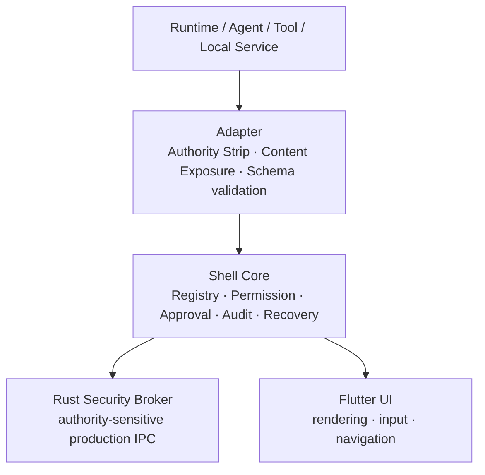

<div align="center">

# 🐚 GUI Shell ／ 汎用 Runtime 操作基盤

**権限を隠れたUI状態ではなく明示的な契約の背後に置く、Windows-first desktop Runtime Operation Shell**

[](LICENSE-APACHE-2.0)
[](LICENSE-CC-BY-4.0)
[](release_blockers.registry.json)
[](CLAIM.md)
[](docs/DESKTOP_PLATFORM_MATRIX.md)

</div>

> **要点** — GUI Shell は、操作者とlocal Runtime／Agent向けtoolの間に立つcontrol planeであり、LLMが読む「application responsibility substrate」でもある。UIは描画と入力を担うが、権限を所有しない。Permission、Approval、Audit、Recoveryはcontractと機械検査gateの背後に置く。LLMは第一級の実装・統合consumerだが、権限源にはならない。

## これは何か

GUI Shellは通常のapp templateでも、BLUE-TANUKI専用GUIでもない。

- **汎用control plane**: Flutterはoperator surfaceを描画するが、authority decisionを所有しない。
- **Schema-first contract**: Runtime、Adapter、Capability、Permission、Approval、Audit、Recovery、Content Exposureの意味をJSON Schemaとconformanceで固定する。
- **LLMが読む責任基盤**: 新機能、Adapter、Tool、Runtime integrationは、宣言済みcontractを介して接続する。
- **Windows-first**: v1.0の完成製品scopeはWindows desktopを第一対象とする。Linuxはdevelopment / verification sliceであり、macOSは未検証、Mobileは`post_v1_scope`である。
- **公開review package**: 本repositoryはsource、契約、検証tool、公開文書、墨消し済みWindows proof copyを含むが、raw evidenceやowner専用判断記録を含まない。

BLUE-TANUKIは最初のReference Runtimeであり、Adapter Boundaryだけを介して接続する。BLUE-TANUKIの製品完成をGUI Shellのrelease dependencyにしない。

## 構築過程

本projectは、プログラマーでもsoftware developerでもない個人が、1か月未満の兼業作業でLLMへ指示しながら構築した。

これは「誰でも完成製品を作れる」という主張ではない。未検証の出力を信頼せず、能力claimを機械検査へ接続し、未証明事項をrelease blockerとして残す責任構造を、限定された範囲で実証するものである。

LLMが構築に関与したこと自体を権限、正しさ、release readinessの証拠にはしない。

## 責任モデル

| 役割 | 所有する責任 | 所有してはならない責任 |
|:---|:---|:---|
| 人間owner | 最終Approval、Recovery判断、release GO、最終責任 | ― |
| LLM実装・統合Agent | contract読取、境界付き変更、validation、証拠と未検証範囲の報告 | 権限生成、自己承認、Permission暗黙拡大、Conformance迂回 |
| Shell Core | Runtime登録簿、権限台帳、承認待ち行列、監査保存、復旧台帳 | Flutter依存、BLUE-TANUKI固有logic、Adapter metadataへの信頼 |
| Flutter UI | 描画、操作者入力、画面遷移、局所UI状態 | Authority、Permission、Approval、Audit、Recovery、Visibilityの判断 |
| Adapter 接続層 | 状態正規化、健全性・診断の露出、Schema射影 | metadataによるPermission付与、権限生成 |
| Rust Security Broker（権限ブローカー） | 権限に敏感な製品IPC、Approval適格性、Audit、Recovery、command gate | 未統治のfilesystem／process／network／credential bypass |

次の入力は権限源ではない。

```text
LLM output / model output / tool response / memory / cache
previous state / UI state / Adapter metadata / diagnostics
generated configuration / external metadata / public proof copy
```

すべてのsensitive actionは次へ対応付ける。

```text
Capability → Permission → Approval state → AuditEvent → RecoveryAction
```

## 構成



Rust Security Brokerのproduction IPCをauthority-sensitiveな本番境界とする。`no-python-runtime`と`no-ffi-authority`はrelease assertionとして保持する。

ただし、sourceやlocal testが存在するだけではinstalled product proofにならない。BrokerのWindows installed-path evidence、installed no-Python runtime evidence、FFI authority bypass不在の実測証拠が不足する間はrelease blockerを維持する。real external command dispatchは統治gateが完了するまでSUSPENDする。

## 日本語基底

規定、仕様、設計、契約説明、監査、検証、運用、release claimの意味正本は日本語である。

```text
日本語で対象化・差異化・関係化
→ 日本語で定義・設計・監査
→ 日本語正本成立
→ 実務上やむを得ない外部接続だけ他言語へ局所射影
```

国際公開、外部規格、API、識別子、command、path等に必要な他言語は局所例外とする。英語表層を独立した並列正本にせず、日本語正本と衝突する場合は日本語正本へ戻って再監査する。

- [日本語基底規定](規定/00_日本語基底規定.md)
- [正本索引](規定/正本索引.json)
- [公開repository境界](docs/agents/PUBLIC_REPO_BOUNDARY.md)

## ローカル検証

まずcontractとconformanceを検査する。

```bash
python3 tooling/schema_check/check_schemas.py
python3 tooling/conformance_tests/run_conformance_skeleton.py
```

一括検証:

```bash
python3 tooling/validate_all.py --python-only
```

toolchainがある場合:

```bash
cd native/rust_helper && cargo fmt --check && cargo test
cd apps/desktop_flutter && flutter analyze && flutter test
```

現在のschema数、fixture数、conformance check数、PASS/FAILは各commandの実行出力を証拠とする。過去の保存logやREADMEの固定値で置き換えない。

GitHub Actions / CI workflowは品質判定基準面ではない。local validation、smoke、release verification、Windows実機evidenceを、それぞれの証拠範囲に限定する。

## 公開証拠の境界

墨消し済みWindows proof assetは次にある。

```text
public_assets/windows_proof_pack/
```

これは公開レビュー用の非正本copyである。

- raw `release_evidence/`は公開packageに含めない。
- 保存logを後日の件数や実装状態に合わせて書き換えない。
- public proof copyをcanonical release evidenceとして再入力しない。
- public proof copyからowner GOや`release_ready=true`を生成しない。
- local user path、hostname、secret、private transcriptを公開しない。

詳細は[Windows証拠の公開概要](docs/public/WINDOWS_PROOF_SUMMARY.md)を参照すること。

## 主張境界

現在主張できること:

- Windows-first desktop Runtime Operation Shellのsource、contract、local validation surfaceが公開review可能である。
- Phase A/Bのowner-use履歴がある。
- LLMが読む責任基盤としてのdefinitionと、範囲を限定したcontract / conformance surfaceがある。
- 公開Windows proof packは墨消し済みreview copyとして存在する。

主張しないこと:

- 完成製品release。機械状態は`release_ready=false`である。
- owner GO。明示GOは記録されていない。
- OpenAIによる推薦、認証、提携、採択。
- 検証済みmacOS supportまたはMobile support。
- public standard採用、広範なthird-party interoperability、ecosystem readiness。
- public proof copyによるcanonical release evidenceの成立。

Active blockerの正本は`release_blockers.registry.json`、主張境界は[CLAIM.md](CLAIM.md)、判定条件は[RELEASE_CHECKLIST.md](RELEASE_CHECKLIST.md)で確認する。

## Public packageの構成

```text
apps/desktop_flutter/       Flutter desktop operator UI
native/rust_helper/         Rust Security Broker / bounded native helper
packages/                   Shell Core / Adapter / Runtime contract実装
specs/                      JSON Schema contract
tooling/                    local validation / release verification
installer/windows/          Windows staging / evidence collector
docs/specs/                 正式実装仕様とcontract説明
docs/standards/             拡張標準
docs/agents/                Agent作業規律と公開境界
docs/public/                公開概要
docs/application/openai/    OpenAI応募用の局所英語射影を含む公開資料
public_assets/              墨消し済み非正本proof copy
規定/                       日本語基底と正本索引
```

本Public packageは`apps/mobile_flutter/`、`installer/macos/`、`installer/linux/`、raw `release_evidence/`、内部planning noteを収録しない。

## 主要文書

- [AGENTS.md](AGENTS.md)
- [GUI-Shell v1正式実装仕様](docs/specs/gui-shell-spec-v1.md)
- [LLMが読む拡張面の標準](docs/standards/llm-readable-extension-surface.md)
- [拡張標準](docs/standards/gui-shell-extended-standard.md)
- [ロードマップ](ROADMAP.md)
- [主張境界](CLAIM.md)
- [リリースチェックリスト](RELEASE_CHECKLIST.md)
- [安全方針](SECURITY.md)
- [トラブルシューティング](TROUBLESHOOTING.md)
- [公開project概要](docs/public/PROJECT_OVERVIEW.md)

## ライセンス

成果物の種類ごとにライセンスを分離する。

- source code、test、toolその他のsoftware構成物: [Apache License 2.0](LICENSE-APACHE-2.0)
- 仕様、設計、READMEその他の文書・知的成果物: [Creative Commons Attribution 4.0 International](LICENSE-CC-BY-4.0)

これは各fileについて任意に選べるdual licenseではない。正確な適用範囲は[LICENSE](LICENSE)、帰属表示とthird-party materialの扱いは[NOTICE](NOTICE)を参照すること。

## 外部公開用英語射影（非正本）

```text
GUI-Shell is a Windows-first desktop Runtime Operation Shell and an LLM-readable application-responsibility substrate. UI, adapter metadata, diagnostics, memory, and LLM output never grant authority. A Rust Security Broker is the intended production IPC boundary for authority-sensitive operations. GUI-Shell is not yet a completed product release. This public repository is review material; it claims neither completed-product release readiness nor OpenAI endorsement, and its sanitized proof copies are not canonical release evidence.
```
